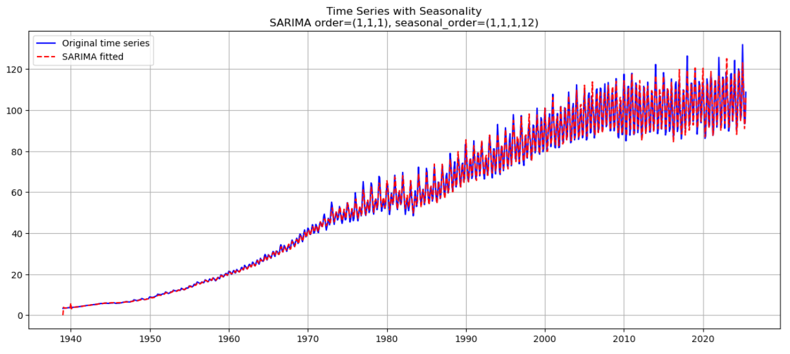
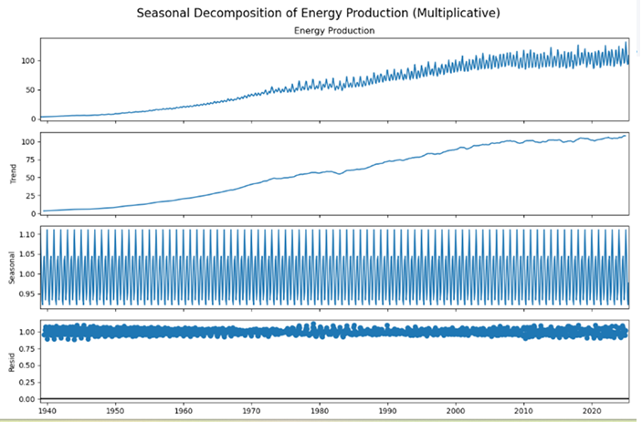
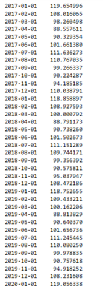
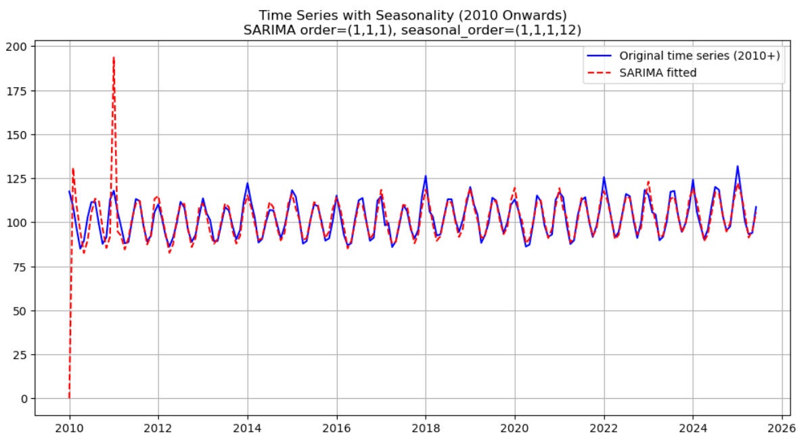
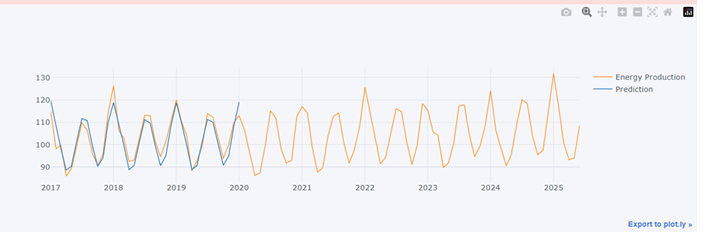
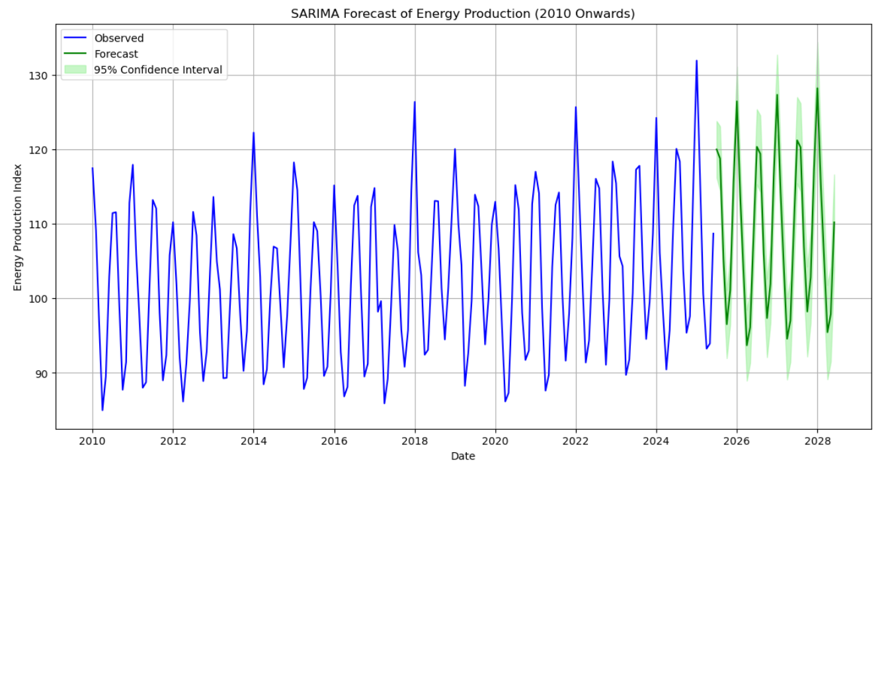

# ⚡ Energy Production Forecasting with SARIMA


> Forecasting U.S. Industrial Energy Production (Electric & Gas Utilities) using Seasonal ARIMA (SARIMA) models — 1939 to 2025  
> Supervised by Priya Virdi | CIMT College | July 2025

---

## 📊 Project Overview

This project applies **time series decomposition** and **SARIMA modeling** to forecast the U.S. Industrial Production Index for Electric and Gas Utilities (**FRED Series: `IPG2211A2N`**).

Using historical data from the Federal Reserve Economic Data (FRED), we:
- Decompose the series into trend, seasonal, and residual components
- Test for stationarity using the Augmented Dickey-Fuller (ADF) test
- Automatically select optimal SARIMA parameters using `pmdarima`
- Generate a 36-month forecast (2022–2025) with 95% confidence intervals

**Key Techniques Used:**
- Multiplicative seasonal decomposition
- Differencing for stationarity
- SARIMA model selection via AIC minimization
- Diagnostic checks and residual analysis
- Interactive visualizations with `plotly` and `matplotlib`

Perfect for showcasing skills in:
✅ Time Series Analysis  
✅ Statistical Forecasting  
✅ Data Preprocessing  
✅ Model Evaluation & Visualization

---

## 📈 Results

### 🏆 Best Model Selected
`SARIMA(1,1,1)(2,1,2)[12]` with **AIC: 4228.12**

## 📈 Forecast Accuracy

- Accurately captures **long-term structural growth** and **annual seasonality**
- Aligns closely with actual values from 2017–2019 (validation period)
- Projects 36 months ahead with interpretable confidence bands

  
*Historical data (blue) vs SARIMA forecast (blue)*

  
*Multiplicative decomposition: Observed, Trend, Seasonal, and Residual components.*


  
*Close-up view showing model fit and future projections.*

  
*SARIMA model fitted to data from 2010 onward — excellent tracking of seasonal cycles.*

  
*forecast (2017–2025) with prediction uncertainty.*

  
 *forecast (2025–2028) showing predicted energy production with 95% confidence intervals.*

## 🚀 Quickstart

### ⚙️ Installation & Setup

Clone the repository and install dependencies:

```bash
git clone https://github.com/womgaalbert/Energy-ARIMA-Forecasting.git
cd Energy-ARIMA-Forecasting
pip install -r requirements.txt
